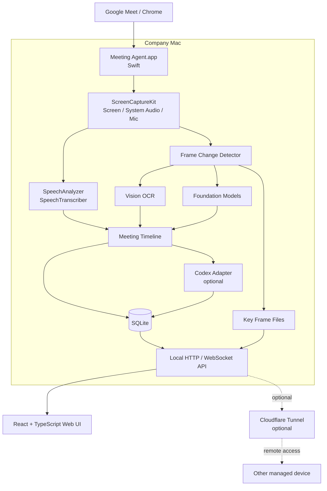

# Meeting Agent 設計・引き継ぎ資料

更新日: 2026-09-01
目的: Google Meet の音声・共有画面を同時に取得し、文字起こし・画面理解・会議要約をローカル中心で実現する macOS 向け Meeting Intelligence ツールの設計引き継ぎ

---

## 1. 背景と課題

現状の Google Meet / Gemini 系の会議要約では、音声中心の理解になりやすく、会議中に共有されていた以下のような情報を十分に取り込めない。

- スライド
- 設計図・アーキテクチャ図
- ER 図
- ソースコード
- 管理画面や Web UI
- 表・数値
- 「ここ」「右側」「この部分」など、表示中の画面を前提とした発言

そのため本ツールでは、単なる文字起こしではなく、**「何を表示しながら、誰が何を話していたか」を時系列で復元できる Meeting Timeline** を生成する。

最終的な価値は「録画」そのものではなく、以下を実現することである。

1. 発話と画面を関連づけた議事録
2. 決定事項・未決事項・Action Item の抽出
3. 発言時に表示されていた画面を根拠として参照可能
4. 会議後に「さっきの ER 図で Reservation と Plan はどういう関係だった？」のような質問を可能にする

---

## 2. 基本方針

### 2.1 採用するアーキテクチャ

最終形は **macOS Native Agent + Web UI** のハイブリッドとする。

- macOS App: 音声/画面キャプチャ、STT、OCR、オンデバイス AI、ローカル保存
- Web UI: 会議一覧、Transcript、Timeline、Screen、Summary、検索
- Codex: 高精度な最終要約の optional provider
- Cloudflare Tunnel: 必要な場合だけリモートアクセス用として利用
- Go Backend: MVP では採用しない。将来、複数端末を集約する中央サーバーが必要になった時点で導入

### 2.2 ローカルファースト

会議データは業務上センシティブになり得るため、基本設計は以下とする。

- 生音声は原則ローカル処理
- 画面は原則ローカル処理
- 動画を丸ごとクラウド送信しない
- 画面差分を検出し、重要な Key Frame のみ保存/解析
- API 利用は optional
- Cloudflare Tunnel はキャプチャ経路ではなく、ローカル Web UI への安全な入口として扱う

---

## 3. 技術選定

| 領域 | 採用技術 | 備考 |
|---|---|---|
| macOS Agent | Swift 6 | Apple Framework を直接利用するため |
| macOS UI | SwiftUI | メニューバー、権限、開始/停止など最小 UI |
| 画面/システム音声 | ScreenCaptureKit | Meet を開いている Chrome の画面・再生音を取得 |
| マイク | ScreenCaptureKit / AVFoundation | 自分のマイクを別ストリームとして取得 |
| STT | SpeechAnalyzer + SpeechTranscriber | ローカル優先。Provider 抽象化する |
| OCR | Vision / RecognizeTextRequest | Key Frame の文字を抽出 |
| 画像理解 | Foundation Models | 対応 OS / Apple Intelligence 利用可能時 |
| Local DB | SQLite | 会議単位の Timeline 保存 |
| 画像保存 | File System | Application Support 配下 |
| Local API | Swift HTTP + WebSocket | localhost の Web UI と連携 |
| Web UI | React + TypeScript + Vite | SSR 不要 |
| Data Fetch | TanStack Query | Web UI 側 |
| 高精度要約 | Codex SDK optional | ChatGPT 認証または API Key。Provider 抽象化 |
| Remote Access | Cloudflare Tunnel optional | 基本機能とは分離 |
| 中央 Backend | Go（将来） | 複数 Mac の同期・組織運用時 |

---

## 4. 全体アーキテクチャ



---

## 5. 重要な設計判断

### 5.1 Web アプリのみにはしない

Web だけでも `getDisplayMedia()` 等による PoC は可能だが、本番構成では以下の理由から macOS Native Agent を採用する。

- ScreenCaptureKit を利用した安定した画面/システム音声キャプチャ
- マイクと Meet 再生音を分離しやすい
- Speech / Vision / Foundation Models を直接利用可能
- バックグラウンド動作との相性
- ローカル AI による機密データ処理

Web UI は引き続き採用し、Native App は主に「Capture / Local AI / Storage / Local API」に限定する。

### 5.2 Go は MVP に入れない

MVP で Swift と Go を分けると、以下が増える。

- IPC
- プロセス管理
- バイナリ配布
- エラー境界
- ローカル API の二重化

Apple ネイティブ機能が中心なので、MVP のローカル Agent は Swift 単体とする。

Go は以下の段階で追加する。

- 複数 Mac から Meeting を中央集約
- 全社検索
- RBAC
- 組織ポリシー
- 管理者 UI
- Cloud Storage
- Queue / Worker

---

## 6. キャプチャ設計

### 6.1 取得対象

Meeting Agent は会社 Mac 上で動作し、Google Meet を開いている Chrome を対象とする。

取得するデータ:

1. **System Audio**
   - Meet から再生される他参加者の音声
2. **Microphone**
   - 自分自身の発話
3. **Screen / Window**
   - Chrome / Meet の表示画面

ScreenCaptureKit では audio capture の設定があり、Apple 公式サンプルでも画面、システム Audio、Microphone を構成可能。

### 6.2 音声トラック

可能な限り以下を別トラックとして保持する。

```text
Track A: Meet system audio
Track B: My microphone
```

利点:

- 自分と他者の区別がある程度容易
- マイク音量と Meet 再生音を個別調整可能
- 将来的な話者推定に利用可能

ただし、**他参加者それぞれの音声は基本的に system audio 内で混ざる**ため、ScreenCaptureKit のみでは参加者単位の完全な speaker attribution はできない。

話者分離は別課題として扱う。

---

## 7. 文字起こし設計

### 7.1 Default

SpeechAnalyzer + SpeechTranscriber を使用する。

Apple SpeechAnalyzer は音声入力と結果を AsyncSequence ベースで扱えるため、Swift Concurrency と合わせてストリーミング STT を行う。

### 7.2 Provider 抽象化

```swift
protocol Transcriber {
    func start() async throws
    func consume(_ buffer: AVAudioPCMBuffer) async throws
    func stop() async throws

    var events: AsyncStream<TranscriptEvent> { get }
}
```

候補実装:

```text
AppleSpeechTranscriber       default
WhisperLocalTranscriber      future
OpenAITranscriber            fallback
```

Apple Speech の日本語精度が要求を満たさない場合でも全体設計を変更せずに置換可能にする。

---

## 8. 画面解析設計

### 8.1 全動画を AI に入れない

長時間会議の映像をそのまま Vision LLM に送る設計は採用しない。

理由:

- 同じスライドを大量に重複解析する
- コスト増
- 処理負荷増
- ストレージ増
- 会議後の検索性が低い

### 8.2 Key Frame Pipeline

```text
ScreenCaptureKit Video
        ↓
低 FPS に Sampling
        ↓
Frame Difference
        ↓
一定以上の変化？
    ├─ No → discard
    └─ Yes
        ↓
      Key Frame
        ↓
 ┌──────┴───────┐
 ↓              ↓
Vision OCR   Foundation Models
 ↓              ↓
OCR Text     Screen Description
 └──────┬───────┘
        ↓
Meeting Timeline
```

MVP ではまず単純な画像差分から開始する。

将来的な候補:

- perceptual hash
- SSIM
- OCR text diff
- UI region aware diff

### 8.3 Key Frame 保存

同一画面が表示され続ける間は、1つの screen_id と表示期間として保存する。

例:

```text
screen_id: 018
start: 13:10:05
end:   13:13:42
```

内容:

```text
OCR:
OAuth 2.1
Authorization Server
Resource Server
PKCE

description:
OAuth 認証フローを示すアーキテクチャ図。
Client / Authorization Server / Resource Server の関係が表示されている。
```

### 8.4 Meet UI Noise 対策

Chrome window 全体の単純差分だけでは、参加者タイル、字幕、マウスカーソル、発話者枠、コントロールバー、通知などにより Key Frame が増殖する。

MVP では以下を行う。

- 可能なら Meet の共有コンテンツ領域を crop して比較する
- 変化検出直後には確定せず、300〜1000ms 程度の安定時間を置く
- `screen_candidate` と確定した `screen_segment` を分離する
- perceptual hash 等で同一画面への復帰と重複を検出する
- Chrome window 全体と共有領域の差分率を計測し、閾値調整用のメトリクスを残す

単純な frame difference は候補抽出に利用し、保存単位は「差分量 + 安定時間 + 重複判定」で決める。

---

## 9. Meeting Timeline

このプロジェクトで最も重要なドメインモデル。

録画動画ではなく、**共通の Capture Clock 上にある時間区間付き Event の集合を会議の中核データとする**。

データは次の3層に分ける。

```text
Ephemeral Capture Buffer
        ↓
Canonical Evidence
  確定 Transcript / Key Frame / OCR
        ↓
Derived Intelligence
  Screen Description / Section Summary / Final Summary
```

- `Ephemeral Capture Buffer`: 障害時の復旧や短時間の再処理に使うリングバッファ。通常終了後に削除する
- `Canonical Evidence`: 会議中に実際に取得・確定した証拠データ。Provider を変更しても保持する
- `Derived Intelligence`: AI による説明・分類・要約。Provider / model / prompt version を記録し、再生成可能にする

### Time Model

- 会議開始時に `capture_clock_origin` を確定する
- 音声、映像、STT、画面イベントは同じ monotonic clock に正規化する
- `startedAtMs` / `endedAtMs` は会議開始からの相対時間とする
- `started_at` / `ended_at` の壁時計は表示・監査用途として別に保持する
- STT 結果の受信時刻ではなく、対象音声区間の時刻を Transcript Event に保存する

### Transcript Event

```json
{
  "id": "utterance-0042",
  "revision": 3,
  "startedAtMs": 1812000,
  "endedAtMs": 1815800,
  "type": "speech",
  "speaker": "self",
  "text": "ここは OAuth 2.1 に準拠させたいです",
  "source": "microphone",
  "isFinal": true,
  "screenRefs": [
    {
      "screenId": "screen-018",
      "relation": "visible_during_speech",
      "overlapMs": 3100,
      "confidence": 0.96
    }
  ]
}
```

### Screen Event

```json
{
  "startedAtMs": 1805000,
  "endedAtMs": 2022000,
  "type": "screen_change",
  "screenId": "screen-018",
  "imagePath": "screens/screen-018.webp",
  "ocr": "OAuth 2.1 ...",
  "description": "OAuth 認証フローのアーキテクチャ図"
}
```

### Screen Reference

発話と画面は多対多で関連づける。単一の `screen_id` は検索最適化用の代表値として持ってもよいが、一次モデルにはしない。

`relation` の初期値:

```text
visible_during_speech   発話中に表示されていた
previously_visible     直前まで表示されていた
explicitly_referenced  「前の図」等の解析で明示参照と推定された
```

`explicitly_referenced` は Derived Intelligence として扱い、confidence と解析元を記録する。

### Meeting Summary

```json
{
  "summary": "...",
  "decisions": [],
  "actionItems": [],
  "openQuestions": [],
  "topics": []
}
```

---

## 10. 画面と発話の関連づけ

発話イベントには、発話区間と重なって表示されていた Screen Segment を関連づける。

```text
13:10:05 SCREEN screen-018
  OAuth architecture diagram

13:10:32 SELF
  「ここは OAuth 2.1 に準拠させたいです」
  screen_refs = [screen-018]

13:11:03 REMOTE
  「Resource Server 側では aud もチェックしますか？」
  screen_refs = [screen-018]
```

これにより要約 LLM には以下のようなコンテキストを構築できる。

```text
[SCREEN screen-018]
OCR:
OAuth 2.1 / PKCE / Resource Server

Description:
OAuth architecture diagram.

[13:10:32]
ここは OAuth 2.1 に準拠させたいです。

[13:11:03]
Resource Server 側では aud もチェックしますか？
```

「これ」「ここ」「右側」などの発話を画面情報で補完することが主要目的。

---

## 11. Foundation Models の利用

Apple Foundation Models をローカル AI Provider として使用する。

2026 年の Apple の macOS / Foundation Models ガイドでは、Foundation Models Framework はネイティブ Swift API として提供され、対応環境ではテキストと画像を含むマルチモーダル入力を扱える。

想定用途:

- Key Frame の説明
- OCR 結果の補完
- Topic / Screen Segment 単位の区間要約
- Topic 分類
- 画面と発話の関係整理

### Context Window 注意

Apple の on-device model は context window に上限がある。固定値を前提にせず、利用可能な API の `contextSize` と token count を実行時に確認する。

そのため 60 分の会議全文を一回で渡さない。

```text
Meeting
 ├ Topic / Screen Segment A → section summary
 ├ Topic / Screen Segment B → section summary
 ├ Topic / Screen Segment C → section summary
 └ ...
        ↓
Section Summaries
        ↓
Final Summary Provider
```

MVP ではこの hierarchical / map-reduce summarization を前提とする。区間は5分固定だけで分割せず、無音区間、Screen Segment の切り替わり、話題変化を利用し、前後に overlap を持たせる。

### Availability

Foundation Models の画像対応などは最新 OS 依存となる可能性があるため、会社 Mac の OS 配布状況を確認する。

古い OS では以下へ degrade 可能にする。

```text
Vision OCR only
+ Transcript
+ Codex / other summarizer
```

---

## 12. Codex Integration

Codex は **optional high-quality summarizer** とする。

リアルタイム処理には使用しない。

会議終了後に以下を入力する。

```text
meeting/
├ transcript.md
├ timeline.json
└ screens/
   ├ screen-001.webp
   ├ screen-002.webp
   └ ...
```

用途:

- 最終要約
- 決定事項抽出
- Action Items
- 未決事項
- 画面を考慮した議論整理

Codex は既存の ChatGPT 認証を再利用可能な実装が存在する。Python SDK では ChatGPT browser login / device-code login が公式に用意されている。

TypeScript SDK も利用可能だが、MVP では Codex を macOS Agent の必須依存にしない。

### Provider interface

```swift
protocol MeetingSummarizer {
    func summarize(meeting: MeetingContext) async throws -> MeetingSummary
}
```

実装:

```text
AppleFoundationModelsSummarizer   default
CodexSummarizer                   optional
OpenAISummarizer                  future fallback
```

### 実装上の方針

Codex SDK を使う場合でも Node.js を Meeting Agent の必須ランタイムにしない。

候補:

1. Codex CLI / existing login を subprocess として利用
2. Codex helper を optional companion process として提供
3. Python SDK を optional helper にする

この選定は Codex integration spike で確定する。

Codex helper にはリポジトリや Application Support 全体を渡さない。会議ごとの一時入力ディレクトリと限定した出力先のみを与え、要約ジョブに不要なファイル書き込み・コマンド実行・ネットワーク権限を許可しない。外部送信対象は Transcript、OCR、Screen Description、Key Frame、Meeting metadata ごとに表示・制御可能にする。

---

## 13. SQLite Schema（初期案）

```sql
CREATE TABLE meetings (
    id TEXT PRIMARY KEY,
    title TEXT,
    started_at TEXT NOT NULL,
    ended_at TEXT,
    capture_clock_origin TEXT NOT NULL,
    status TEXT NOT NULL,
    created_at TEXT NOT NULL,
    updated_at TEXT NOT NULL
);

CREATE TABLE transcript_events (
    id TEXT PRIMARY KEY,
    meeting_id TEXT NOT NULL,
    revision INTEGER NOT NULL DEFAULT 1,
    started_at_ms INTEGER NOT NULL,
    ended_at_ms INTEGER,
    speaker TEXT,
    source TEXT NOT NULL,
    text TEXT NOT NULL,
    is_final INTEGER NOT NULL DEFAULT 0,
    created_at TEXT NOT NULL,
    updated_at TEXT NOT NULL,
    FOREIGN KEY(meeting_id) REFERENCES meetings(id) ON DELETE CASCADE
);

CREATE TABLE screen_events (
    id TEXT PRIMARY KEY,
    meeting_id TEXT NOT NULL,
    started_at_ms INTEGER NOT NULL,
    ended_at_ms INTEGER,
    image_path TEXT NOT NULL,
    ocr TEXT,
    description TEXT,
    analysis_status TEXT NOT NULL DEFAULT 'pending',
    created_at TEXT NOT NULL,
    updated_at TEXT NOT NULL,
    FOREIGN KEY(meeting_id) REFERENCES meetings(id) ON DELETE CASCADE
);

CREATE TABLE transcript_screen_refs (
    transcript_id TEXT NOT NULL,
    screen_id TEXT NOT NULL,
    relation TEXT NOT NULL,
    overlap_ms INTEGER,
    confidence REAL,
    provider TEXT,
    PRIMARY KEY(transcript_id, screen_id, relation),
    FOREIGN KEY(transcript_id) REFERENCES transcript_events(id) ON DELETE CASCADE,
    FOREIGN KEY(screen_id) REFERENCES screen_events(id) ON DELETE CASCADE
);

CREATE TABLE summaries (
    id TEXT PRIMARY KEY,
    meeting_id TEXT NOT NULL,
    provider TEXT NOT NULL,
    model TEXT,
    model_version TEXT,
    prompt_version TEXT,
    summary TEXT NOT NULL,
    payload_json TEXT,
    status TEXT NOT NULL,
    is_active INTEGER NOT NULL DEFAULT 0,
    created_at TEXT NOT NULL,
    FOREIGN KEY(meeting_id) REFERENCES meetings(id) ON DELETE CASCADE
);

CREATE INDEX idx_transcript_meeting_time
    ON transcript_events(meeting_id, started_at_ms);
CREATE INDEX idx_screen_meeting_time
    ON screen_events(meeting_id, started_at_ms);
CREATE INDEX idx_summary_meeting_created
    ON summaries(meeting_id, created_at);
```

partial transcript は安定した event id に対する revision update とし、final 確定後は Canonical Evidence として扱う。再解析ジョブの status、error、retry count はジョブテーブルまたは同等の永続キューに保存する。

MVP では SQLite ライブラリ選定は任せる。SwiftData/Core Data に寄せる必要はなく、将来の export / migration の容易さから生 SQLite 系でもよい。ただし初期実装から schema version と migration を用意し、外部キーを有効化する。

---

## 14. ローカルファイル構成

```text
~/Library/Application Support/MeetingAgent/
├── meetings.sqlite
└── meetings/
    └── <meeting-id>/
        ├── screens/
        │   ├── screen-0001.webp
        │   ├── screen-0002.webp
        │   └── ...
        ├── export/
        │   ├── transcript.md
        │   ├── timeline.json
        │   └── summary.md
        └── metadata.json
```

原則として生録画は保存しない。

必要になった場合のみ debug option として一定期間保存する。

ただし、STT停止や解析失敗から回復できるよう、メモリまたは一時領域に数分間のリングバッファを持つ。正常終了後は自動削除する。必要に応じて、明示的な設定で暗号化した圧縮音声・低FPS映像を短期間だけ保持する Recovery Mode を提供する。

---

## 15. Local API

例:

```text
GET    /api/health
GET    /api/meetings
GET    /api/meetings/:id
GET    /api/meetings/:id/transcript
GET    /api/meetings/:id/screens
GET    /api/meetings/:id/timeline
GET    /api/meetings/:id/summary

POST   /api/capture/start
POST   /api/capture/stop
POST   /api/meetings/:id/summarize
POST   /api/meetings/:id/export

WS     /api/events
```

WebSocket events:

```text
capture.started
capture.stopped
transcript.partial
transcript.final
screen.changed
screen.analyzed
summary.started
summary.completed
error
```

Local API は `127.0.0.1` bind をデフォルトとする。ただし localhost bind だけを認証境界とはみなさない。

- Agent 起動時にランダムなセッショントークンを発行する
- HTTP / WebSocket の両方で認証する
- `Origin` / `Host` を検証し、CORS を必要最小限にする
- Capture start、外部 AI 送信、export は CSRF 耐性を持たせる
- Tunnel 有効時は別セキュリティプロファイルとし、Cloudflare Access と Local API 認可を併用する

---

## 16. Web UI

### Stack

```text
React
TypeScript
Vite
TanStack Query
```

Next.js は使用しない。

理由:

- SSR 不要
- Local API が Backend
- Server Components 不要
- ビルド/配布を軽量化したい

### 画面

MVP:

1. Home / Capture Status
2. Meeting List
3. Meeting Detail
   - Transcript
   - Screen Timeline
   - Summary
4. Settings
   - STT provider
   - Summary provider
   - retention

将来:

- Semantic Search
- Ask This Meeting
- Action Item tracking
- Speaker mapping

---

## 17. Cloudflare Tunnel

Cloudflare Tunnel は optional。

用途:

```text
Remote managed device
        ↓
Cloudflare Access
        ↓
Cloudflare Tunnel
        ↓
Company Mac localhost API/UI
```

重要:

- Tunnel 自体が Meet の音声/画面を取得するわけではない
- Capture Agent は Meet が動いている Mac 上に必要
- Cloudflare を基本機能の依存にしない
- 会社のポリシーで Tunnel が禁止されても Local Mode は動作すること

会社データを個人 PC に転送する構成は技術的には可能だが、デフォルト設計にはしない。

---

## 18. Chrome Extension の位置づけ

MVP の必須機能にはしない。

将来的に **Meet Metadata Sensor** として追加する候補。

取得候補:

- Meet URL / meeting code
- Meeting title
- Participant names
- Chat
- Caption DOM
- Screen sharing state

役割分担:

```text
Screen / Audio   → macOS Agent
Meet metadata    → Chrome Extension (optional)
```

これにより Native Agent が Chrome DOM に依存しすぎない構成を維持する。

---

## 19. 話者識別について

MVP の大きな未解決事項。

ScreenCaptureKit だけでは、Meet の system audio は他参加者の音声が混ざる。

MVP:

```text
speaker = self     microphone track
speaker = remote   system audio track
```

まででよい。

将来の候補:

- Speech diarization
- Meet caption DOM + participant metadata
- Chrome Extension
- Meet Media API が実運用可能になった場合の adapter

speaker attribution を理由に MVP を止めないこと。

---

## 20. Capture Adapter 抽象化

将来 Meet Media API 等へ置き換えられるよう、Capture を抽象化する。

```swift
protocol MeetingCaptureAdapter {
    func start() async throws
    func stop() async throws

    var audioEvents: AsyncStream<AudioEvent> { get }
    var videoEvents: AsyncStream<VideoFrameEvent> { get }
}
```

初期実装:

```text
ScreenCaptureKitAdapter
```

将来:

```text
MeetMediaApiAdapter
ChromeCaptureAdapter
RecordingFileAdapter
```

---

## 21. 推奨モジュール構成

```text
meeting-agent/
│
├── apps/
│   ├── macos/
│   │   ├── Sources/
│   │   │   ├── App/
│   │   │   ├── Capture/
│   │   │   ├── Audio/
│   │   │   ├── Transcription/
│   │   │   ├── Vision/
│   │   │   ├── Intelligence/
│   │   │   ├── Meeting/
│   │   │   ├── Storage/
│   │   │   └── Server/
│   │   └── Tests/
│   │
│   └── web/
│       ├── src/
│       ├── package.json
│       └── vite.config.ts
│
├── packages/
│   └── codex-helper/        # optional / future
│
├── schemas/
│   ├── meeting.schema.json
│   ├── transcript.schema.json
│   ├── timeline.schema.json
│   └── summary.schema.json
│
└── docs/
```

---

## 22. MVP Scope

### MVP-0: Capture Spike

最優先。

以下だけを確認する。

- [ ] ScreenCaptureKit で Chrome / Meet 画面が取れる
- [ ] Meet の system audio が取れる
- [ ] 自分の microphone が別で取れる
- [ ] 権限要求 UX を確認
- [ ] 60 分程度動かして安定性確認

この段階では UI / DB / AI は最小でよい。

Capture Spike では通常の取得可否に加え、Meet UI noise の影響も計測する。

- [ ] Chrome window 全体と共有コンテンツ領域の差分を比較
- [ ] 字幕、参加者タイル、カーソル、コントロール表示による誤検出を計測
- [ ] 音声と映像の timestamp を同一 clock に正規化できることを確認

### MVP-0.5: Evidence Model Spike

- [ ] 発話区間と Screen Segment を多対多で関連づける
- [ ] partial transcript を同一 event の revision として final へ更新する
- [ ] 解析が遅れても Capture と Evidence 保存が継続する
- [ ] リングバッファの生成・正常終了時削除を確認する
- [ ] 強制終了後に途中 Meeting と未完了ジョブを回収する

### MVP-1: Transcript

- [ ] SpeechAnalyzer に system audio を投入
- [ ] microphone も文字起こし
- [ ] Transcript Event に timestamp を付ける
- [ ] self / remote を区別
- [ ] SQLite 保存

### MVP-2: Screen Timeline

- [ ] Video Frame sampling
- [ ] frame difference
- [ ] Key Frame 保存
- [ ] Vision OCR
- [ ] 発話区間と表示中 Screen Segment を多対多で紐付け

### MVP-3: AI Screen Understanding

- [ ] Foundation Models availability check
- [ ] Key Frame + OCR を解析
- [ ] Screen description 保存
- [ ] 非対応 OS の graceful fallback

### MVP-4: Meeting Summary

- [ ] section summaries
- [ ] final summary
- [ ] decisions
- [ ] action items
- [ ] open questions
- [ ] summary schema 固定

### MVP-5: Web UI

- [ ] Meeting list
- [ ] Transcript timeline
- [ ] Screens
- [ ] Summary
- [ ] Capture status

### MVP-6: Codex optional integration

- [ ] existing Codex auth reuse を確認
- [ ] ChatGPT login flow を確認
- [ ] timeline + images を入力
- [ ] structured summary を返す
- [ ] Apple provider と比較

---

## 23. MVP 完了条件

最低限、30〜60 分の Google Meet に対して以下が成立すること。

1. Capture 開始/停止できる
2. 他参加者の Meet 音声を文字起こしできる
3. 自分の音声を文字起こしできる
4. 共有/表示画面の主要な変更を Key Frame として保存できる
5. Key Frame から OCR を取得できる
6. 発話区間に表示中の Screen Segment が紐付く
7. 会議終了後に Summary / Decisions / Action Items が生成される
8. Local Web UI から結果を確認できる
9. 通常動作では生動画を外部サービスへ送らない

品質評価では、機能の有無に加えて以下を測定する。数値目標は Capture Spike と実会議サンプルで baseline を取得してから確定する。

- 60分 Capture の欠落時間とクラッシュ率
- 音声・映像・Transcript の timestamp ずれ
- 日本語 STT の精度と確定遅延
- Key Frame の取りこぼし率と重複率
- 決定事項・Action Item の precision / recall
- CPU、メモリ、ディスク使用量
- Meet 通話品質への影響
- 強制終了後の会議データ復旧率

---

## 24. セキュリティ / プライバシー

必須で考慮する。

### Data handling

- Local-first
- 生動画をデフォルト保存しない
- Key Frame の retention 設定
- Transcript の retention 設定
- 外部 AI を使う場合は明示的に provider を表示
- 外部送信前に確認/ポリシー制御できる設計
- Transcript、OCR、Screen Description、Key Frame、Meeting metadata ごとに送信対象を表示・制御
- 外部 AI の provider / model /送信時刻を監査情報として保存

### Permissions

macOS 権限:

- Screen Recording
- Microphone
- Speech recognition / required assets

ユーザーにキャプチャ状態が明確に分かる UI にする。

### Company use

会社 PC で利用する場合、技術的な可否とは別に以下を確認すること。

- 会議録音/録画の社内ルール
- 相手方への告知要否
- 顧客情報・個人情報の扱い
- Cloudflare Tunnel 利用可否
- ChatGPT / Codex への業務データ送信ポリシー
- Apple Intelligence 利用ポリシー
- Signing / Notarization / MDM 配布方法

---

## 25. 非機能要件

### Performance

Capture 処理が Meet の品質を悪化させないこと。

目標:

- CPU spike を抑える
- Video analysis は low FPS
- AI 処理は capture path から分離
- 重い分析は actor / task / queue で非同期

### Reliability

- Capture 中の Web UI 再読み込みで録画を止めない
- Web UI と Capture Engine の lifecycle を分離
- STT が失敗しても Capture 自体は継続
- Foundation Models が unavailable でも OCR / Transcript は残す
- Codex が失敗しても Meeting データは失わない

### Pipeline / Backpressure

Capture path は解析処理から分離する。

```text
Capture
  ↓
Durable Evidence Write
  ↓
Bounded Analysis Queue
  ↓
OCR / Screen Understanding / Summary
```

- Capture と Canonical Evidence の永続化を最優先する
- 解析キューには上限を設ける
- キュー超過時は Capture を止めず、低優先度 Frame を間引くか会議後処理へ移す
- OCR、Foundation Models、Codex の失敗は独立して retry 可能にする
- 再起動後に未完了ジョブを再開できる永続キューを持つ

Meeting lifecycle:

```text
idle → capturing → finalizing → analyzing → completed
             └──────────────→ interrupted
各処理 ─────────────────────→ partially_completed / failed
```

アプリ起動時に `capturing` のまま残った Meeting を検出し、`interrupted` として回収する。

---

## 26. コスト方針

基本構成:

```text
ScreenCaptureKit     local
SpeechAnalyzer       local
Vision OCR           local
Foundation Models    local
SQLite               local
Web UI               local
```

したがって API 利用料は基本 0 を目標とする。

外部コストが発生する可能性があるのは以下。

- OpenAI STT fallback
- OpenAI API summarizer
- Codex の契約 / 追加利用枠
- Cloudflare 有料機能を利用する場合

既存 ChatGPT/Codex 契約の利用枠を活用できる場合は Codex を優先候補にする。

---

## 27. 次の Agent に最初にやってほしいこと

**UI や要約モデルから作らないこと。**

まず `MVP-0 Capture Spike` を実装する。

最初の成果物は、小さな macOS App で十分。

```text
[Start Capture]

System Audio RMS: ███████
Microphone RMS:   ████
Video Frames:     1234

[Stop]
```

確認項目:

1. Google Meet の相手の音声を system audio として取得できるか
2. 自分の microphone を同時取得できるか
3. Chrome window / display frame を取得できるか
4. 30〜60 分の連続 Capture が安定するか
5. Screen Recording / Microphone 権限 UX に問題がないか

ここが成立した後に SpeechAnalyzer と Vision を接続する。

---

## 28. 次の Agent が判断してよい事項

以下はまだ固定しない。

- SQLite library
- Swift HTTP Server implementation
- image diff algorithm
- Key Frame 保存形式（WebP / HEIF / JPEG）
- frame sampling rate
- SpeechAnalyzer の buffering strategy
- Codex helper を Python / TypeScript / CLI のどれにするか
- Web UI を macOS App に bundle する方式

ただし以下は維持する。

1. Swift が Capture の主体
2. Local-first
3. Meeting Timeline が中心モデル
4. Web UI と Capture engine の lifecycle を分離
5. AI Provider / STT Provider は差し替え可能
6. Go Backend は MVP に入れない
7. Codex / Cloudflare は optional

---

## 29. 公式ドキュメント（引き継ぎ用）

Apple ScreenCaptureKit
- https://developer.apple.com/documentation/screencapturekit/
- https://developer.apple.com/documentation/screencapturekit/capturing-screen-content-in-macos

Apple SpeechAnalyzer
- https://developer.apple.com/documentation/speech/speechanalyzer
- https://developer.apple.com/documentation/speech/speechtranscriber

Apple Vision OCR
- https://developer.apple.com/documentation/vision/recognizetextrequest

Apple Foundation Models / context
- https://developer.apple.com/jp/wwdc26/guides/macos/
- https://developer.apple.com/documentation/foundationmodels/managing-the-context-window

OpenAI Codex
- https://github.com/openai/codex
- https://github.com/openai/codex/tree/main/sdk
- https://github.com/openai/codex/blob/main/sdk/python/docs/getting-started.md
- https://github.com/openai/codex/blob/main/sdk/typescript/README.md

Cloudflare Tunnel
- https://developers.cloudflare.com/cloudflare-one/connections/connect-networks/

---

## 30. 一文での引き継ぎ

> Google Meet を会社 Mac 上の Swift 製 Meeting Agent で ScreenCaptureKit により画面・システム音声・マイクを取得し、SpeechAnalyzer で文字起こし、Vision + Foundation Models で画面変化を理解して、発話と表示画面を紐付けた Meeting Timeline を SQLite に保存する。React/Vite の Web UI で閲覧し、最終要約は Apple Foundation Models をデフォルト、Codex を optional 高精度 provider とする。Cloudflare Tunnel と将来の Go Backend はコア機能から分離する。
